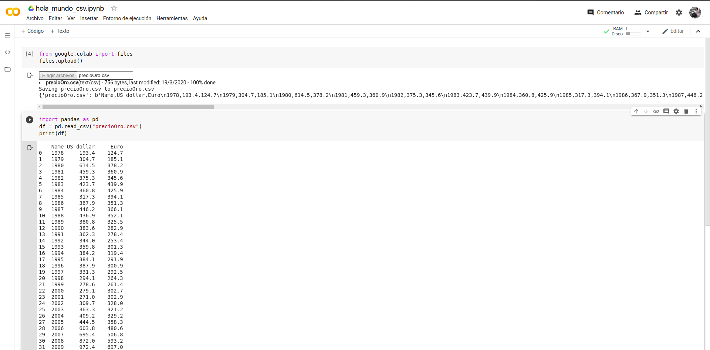
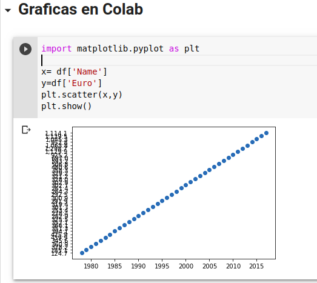

# Primeros pasos en Colab Google
Para este ejercicio entramos en [aqui](https://colab.research.google.com/ 'Ir a Colab')

El documento que vamos a subir descargalo [aquí](https://drive.google.com/file/d/1vKGkF5IN7GebtC0q8cdSN89hJ-kgdXeU/view "Ir a descargar csv")
Lo que realizaremos:
- Agregar un csv para manipularlo en Colab 
- sdas d

## Código
1) Instalamos la dependecia `https://colab.research.google.com/`
2) Estas líneas nos permitirán subir un archivo a Colab
`from google.colab import files`
`files.upload()`
3) Agregamos un nuevo código dentro de Colab e imprimimos el archivo que subimos y tendremos algo parecido a: 

  

4) Agregamos un bloque de texto y graficamos en otro bloque de código y listo!

  

